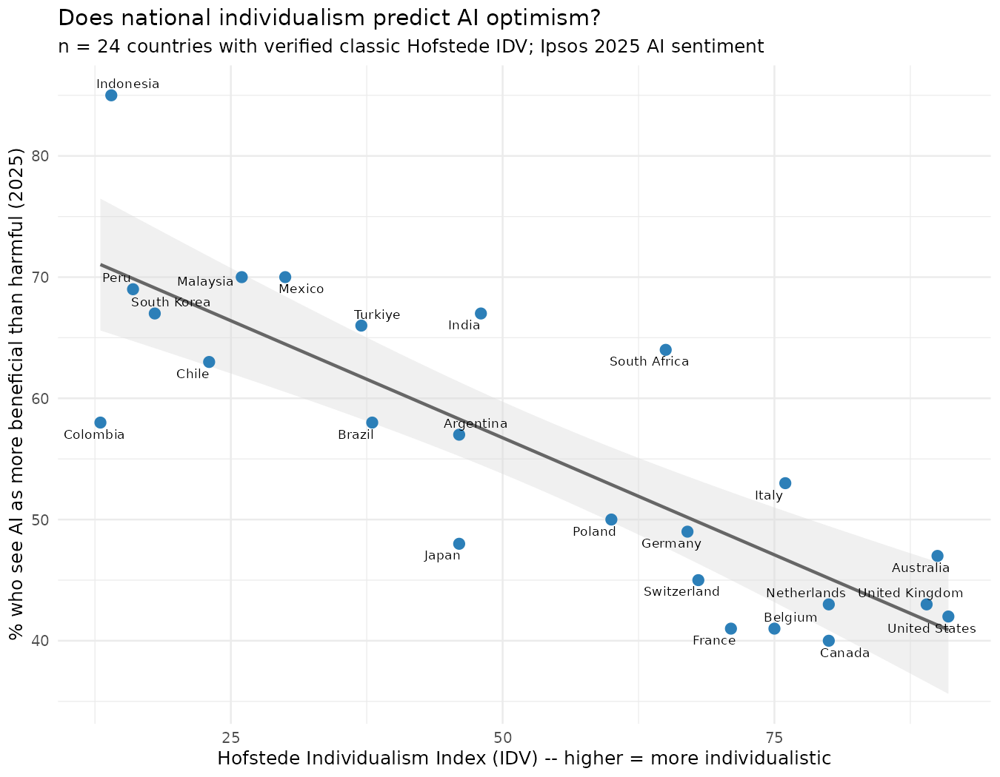

# Abstract {-}

Global surveys of public attitudes toward AI consistently find a striking regional pattern:
countries such as Indonesia and Thailand report overwhelming optimism about AI, while
countries such as Canada and the United States are far more skeptical. Cross-cultural
psychology offers a candidate explanation: individualistic cultures tend to frame new
technology as a potential threat to personal autonomy, while collectivist cultures more
often frame it as a tool that helps people function within their social environment. This
analysis tests that explanation directly and quantitatively, correlating Hofstede's
Individualism Index against Ipsos's 2025 AI Monitor survey. While checking the underlying
cultural-dimension data, a substantive methodological issue was uncovered: the current
official Hofstede Insights source uses a different, non-comparable methodology for this
specific dimension than the classic scores used in most published research -- a distinction
Hofstede's own successor organisation explicitly warns about. The primary analysis
therefore uses only the 24 countries whose classic IDV score could be confirmed against a
single consistent source, finding a strong, statistically robust negative correlation
(r=-0.83, p=5.2x10⁻⁷): individualism alone explains approximately 69% of the cross-country
variation in AI sentiment among these 24 countries.

# Introduction and Motivation

Public commentary on the global divide in AI sentiment tends to reach for economic
explanations (wealthier countries have more to lose; poorer countries see AI as a path to
catching up) or narrower cultural anecdotes (Japan's friendly-robot pop culture versus
Hollywood's dystopian AI narratives). This analysis tests a more specific, established
psychological construct directly: Hofstede's Individualism Index, a widely used measure of
whether a society emphasizes individual autonomy or group interdependence. The hypothesis,
drawn from published cross-cultural psychology research, is that individualistic societies
frame AI primarily as a threat to personal autonomy and privacy, while collectivist
societies more often frame it as an extension of the self that helps one function within a
group -- a positive frame in a collectivist value system.

# Research Question

**Does Hofstede's Individualism Index (IDV) correlate with the percentage of a country's
population who see AI as more beneficial than harmful?**

# Data and Limitations

**AI sentiment.** Ipsos AI Monitor 2025, a 30-country Global Advisor survey of 23,216
adults, fielded March 21 - April 4, 2025. The specific item used is "Products and services
using artificial intelligence have more benefits than drawbacks."

**Cultural dimension.** Hofstede's Individualism Index (IDV), a 0-100 scale where higher
values indicate greater individualism.

**Known limitations.**

- **This Ipsos wave does not include China.** The widely cited "China 83%" AI-optimism
  figure comes from a different Ipsos wave (cited in Stanford's AI Index 2025), not the
  2025 30-country wave used here.
- **Two incompatible measures are both called "Hofstede Individualism."** This is the most
  important limitation of this analysis, and it materially changed the reported result.
  While sourcing IDV scores for all 30 Ipsos countries, six (Thailand, Singapore, Ireland,
  Sweden, Hungary, Spain) could not be confirmed against the same single, internally
  consistent peer-reviewed source used for the other 24. Attempting to resolve this by
  checking the current official Hofstede Insights website revealed a deeper problem: that
  source switched several years ago to a different underlying methodology for this
  specific dimension, based on a 2022 study by Minkov and Kaasa. Hofstede's own successor
  organisation (geerthofstede.com) states this directly: the newer measure produces
  "counter-intuitive results" (for example, rating Japanese culture as more individualistic
  than American culture, which contradicts the classic scores used throughout most
  published research), and that "Minkov-Kaasa-Individualism is actually a different
  concept than Hofstede's Individualism, with different data behind it." Using the current
  official website to fill the six missing scores would therefore not have resolved the
  data-quality gap -- it would have silently combined two non-comparable constructs under
  one column name. For this reason, the **primary analysis in this report uses only the 24
  countries with a confirmed classic-IDV score**, and the six affected countries are
  excluded from the headline result rather than patched with data of uncertain
  comparability.
- **Sample representativeness.** Ipsos's own methodology discloses that several countries
  in the survey (including Brazil, Indonesia, Malaysia, Thailand, and Turkiye) have samples
  skewed toward more urban, educated, or affluent respondents than their general
  population.
- **Correlational, not causal.** A strong correlation between individualism and AI
  sentiment does not establish that cultural values cause the sentiment gap. Both could be
  driven by a shared third factor -- for example, economic growth expectations, government
  AI strategy and messaging, or media environment -- that this analysis does not measure
  directly.

# Methodology

1. **Clean and merge** (`analysis.R`, Part 1): the two datasets were joined on country
   name. Each row was flagged according to whether its IDV score came from the single
   consistent classic-IDV source. The primary analysis dataset was restricted to the 24
   countries passing this check.
2. **Test** (Part 2): Pearson and Spearman correlations were computed between IDV and AI
   sentiment on the primary (n=24) dataset, followed by a simple linear regression. The
   result of including the six excluded countries using their unconfirmed-source values is
   also printed to `stats_results.txt`, explicitly labeled as not a reported finding, to
   document that it does not change the qualitative conclusion.

# Results

**Primary analysis: n = 24 countries** with a confirmed classic Hofstede IDV score.

| Test | Result |
|---|---|
| Pearson correlation | r = -0.83, p = 5.2x10⁻⁷ |
| Spearman correlation | rho = -0.82, p = 9.3x10⁻⁷ |
| Linear model | R² = 0.69, slope = -0.39 |

Table: Summary of statistical tests, primary analysis (n=24).

The relationship is visualized in Figure 1: a strong, clearly linear, negative
relationship, with the most collectivist countries in the sample (Indonesia, Malaysia,
Peru, South Korea) clustered at the high-sentiment end, and the most individualistic
countries (the United States, Australia, the United Kingdom, Canada) clustered at the
low-sentiment end.

{width=95%}

Individualism alone explains approximately 69% of the variance in AI sentiment across
these 24 countries (R²=0.69). For transparency, `stats_results.txt` also reports what the
correlation looks like if the six excluded countries are added back in using their
unconfirmed-source values (r=-0.85, n=30) -- included only to document that the primary
conclusion is not sensitive to their exclusion, not as an alternative valid estimate,
since doing so would mix potentially incompatible IDV measurement approaches.

# Discussion

The strength of this correlation (R²=0.69) is worth treating with appropriate caution
precisely because it is so strong. Cross-national social-attitude research rarely finds a
single cultural variable explaining more than two-thirds of the variance in a complex,
multiply-determined attitude like technology sentiment. Three considerations are worth
holding alongside the headline number.

First, individualism is very likely correlated with other national characteristics that
plausibly also shape AI sentiment -- GDP per capita, media environment, government AI
strategy and public messaging, and existing familiarity with AI tools through daily life.
This analysis tests a bivariate relationship; it does not control for these other factors.

Second, the data-quality investigation required to build this dataset properly turned out
to be a finding in its own right. Discovering that Hofstede's own successor organisation
has publicly disavowed comparability between the classic IDV measure and the current
official website's Individualism scores is a genuinely useful methodological note for
anyone doing quantitative cross-cultural research: a citation to "Hofstede's Individualism
Index" is no longer sufficient on its own to specify which measure is meant, and mixing
the two without checking would produce a dataset that looks complete but combines
non-comparable numbers under a single column name.

Third, the exclusion of China from this particular Ipsos wave is a meaningful gap. China
is frequently cited as having the single highest AI optimism (83% in a separate Ipsos
wave) and, under the classic Hofstede framework, one of the most collectivist cultures
measured (IDV=20). Its absence from the 30-country sample used here does not undermine the
finding, since the pattern holds clearly across the 24 countries analyzed, but a verified
China data point would have strengthened the sample's coverage at exactly the extreme end
of both variables.

# Limitations and Future Work

1. **Multivariate modeling.** A regression including GDP per capita, government AI
   strategy indicators, and media environment measures alongside individualism would test
   whether the cultural-dimension effect survives controlling for these plausible
   confounds.
2. **Resolving the six excluded countries properly.** Locating classic-IDV-specific values
   (not the newer Minkov-Kaasa measure) for Thailand, Singapore, Ireland, Sweden, Hungary,
   and Spain from an academic source using the original IBM-survey methodology would allow
   them to be added back to the primary analysis with confidence.
3. **Including China.** Locating a wave of the Ipsos AI Monitor (or a comparable survey)
   that includes both China and the other countries in a single consistent administration
   would allow the extreme end of both variables to be tested directly within one dataset.
4. **Longitudinal tracking.** Since Ipsos fields this survey annually, tracking whether the
   individualism-sentiment relationship strengthens, weakens, or holds steady as AI becomes
   more familiar globally would be a natural extension.

# Conclusion

Hofstede's classic Individualism Index is a strong, statistically robust predictor of
national AI sentiment across the 24 countries in this analysis with a confirmed score,
explaining approximately 69% of the cross-country variance. This is consistent with --
though not sufficient on its own to prove -- the cross-cultural psychology explanation that
individualistic societies frame AI primarily as a threat to personal autonomy, while
collectivist societies more often frame it as a tool that helps people function within
their social environment. Building this dataset also surfaced a genuine methodological
finding: two incompatible measures currently share the name "Hofstede Individualism," and
treating them as interchangeable would silently corrupt any analysis that mixes them.

# References {-}

Ipsos. (2025). *The Ipsos AI Monitor 2025: A 30-country Ipsos Global Advisor Survey*.
Retrieved from ipsos.com

Hofstede, G. (1997). *Cultures and Organizations: Software of the Mind*. McGraw-Hill.

Minkov, M., & Kaasa, A. (2022). A test of Hofstede's model of culture following his own
approach. *Journal of International Management*, 28(4).
